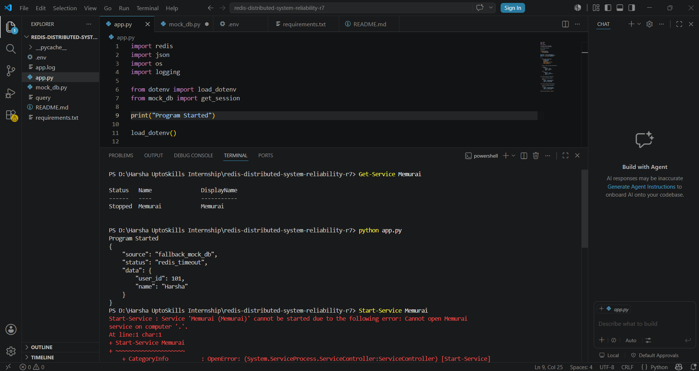
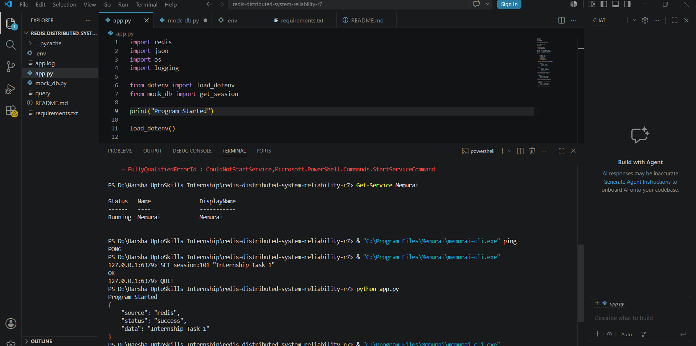
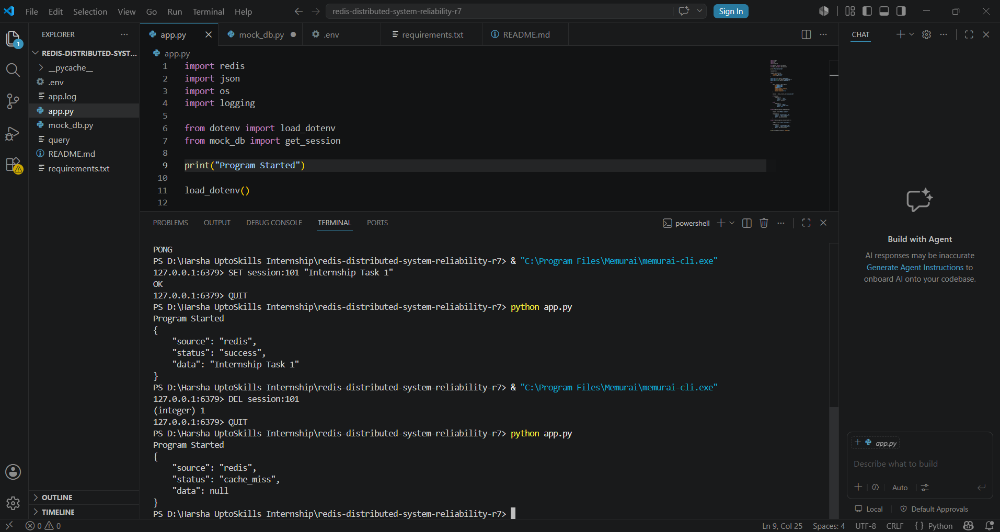

# Redis Distributed System Reliability (CAP)

## Overview

This project demonstrates how a distributed system can gracefully handle Redis failures by falling back to a local mock database. The application first attempts to retrieve session data from Redis. If Redis is unavailable or unresponsive, the application automatically switches to a fallback data source instead of crashing.

---

## Problem Statement

In distributed systems, cache servers such as Redis may become unavailable due to network failures, service outages, or timeout issues. The objective of this project is to ensure system reliability by implementing a fallback mechanism that provides data even when Redis is unreachable.

---

## Technologies Used

* Python 3
* Redis (Memurai for Windows)
* redis-py
* python-dotenv
* Logging Module

---

## Project Structure

```text
redis-distributed-system-reliability-r7/
│
├── app.py
├── mock_db.py
├── .env.example
├── requirements.txt
├── README.md
└── Screenshots/
    ├── redis-success.png
    ├── cache-miss.png
    └── fallback-response.png
```

---

## Setup Instructions

### 1. Clone Repository

```bash
git clone <repository-url>
cd redis-distributed-system-reliability-r7
```

### 2. Install Dependencies

```bash
pip install -r requirements.txt
```

### 3. Create Environment File

Create a `.env` file:

```env
REDIS_HOST=localhost
REDIS_PORT=6379
REDIS_DB=0
```

### 4. Start Redis (Memurai)

Ensure the Memurai service is running before executing the application.

---

## Running the Application

```bash
python app.py
```

---

## Application Flow

```text
Application
     |
     v
   Redis
     |
     | Success
     v
Return Session Data

     OR

Redis Failure / Timeout
     |
     v
Fallback Mock Database
     |
     v
Return JSON Response
```

---

# Demonstration

## 1. Redis Success Scenario

Redis is running and contains the requested session data.



### Output

```json
{
    "source": "redis",
    "status": "success",
    "data": "Internship Task 1"
}
```

---

## 2. Cache Miss Scenario

Redis is available but the requested key does not exist.



### Output

```json
{
    "source": "redis",
    "status": "cache_miss",
    "data": null
}
```

---

## 3. Fallback Mechanism Scenario

Redis is unavailable or not responding. The application automatically retrieves data from the mock database.



### Output

```json
{
    "source": "fallback_mock_db",
    "status": "redis_timeout",
    "data": {
        "user_id": 101,
        "name": "Harsha"
    }
}
```

---

## Error Handling

The application handles the following Redis failures:

### ConnectionError

Occurs when Redis is unreachable.

```python
except redis.exceptions.ConnectionError:
```

### TimeoutError

Occurs when Redis is slow or unresponsive.

```python
except redis.exceptions.TimeoutError:
```

### Timeout Configuration

```python
socket_connect_timeout=2
socket_timeout=2
```

These settings help distinguish between an unavailable Redis server and a slow Redis server.

---

## CAP Theorem and Redis

The CAP Theorem states that a distributed system can provide only two of the following three guarantees:

* Consistency (C)
* Availability (A)
* Partition Tolerance (P)

### Redis as AP

In caching deployments, Redis often prioritizes:

* Availability
* Partition Tolerance

The system continues serving requests even during partial failures.

### Redis as CP

With stricter replication and failover configurations, Redis can prioritize:

* Consistency
* Partition Tolerance

Some requests may be delayed until consistency is restored.

Therefore, Redis can behave as either an AP or CP system depending on its configuration.

---

## Key Learning Outcomes

* Redis integration with Python
* Environment variable management using python-dotenv
* Graceful degradation in distributed systems
* Exception handling using ConnectionError and TimeoutError
* Fallback mechanisms for improved reliability
* Understanding Redis behavior under failures
* CAP Theorem concepts in distributed systems

---

## Project Highlights

- Implemented Redis-based session retrieval using Python.
- Designed a fallback mechanism to ensure system reliability during Redis failures.
- Handled both ConnectionError and TimeoutError scenarios gracefully.
- Used environment variables for secure configuration management.
- Maintained consistent JSON responses across all data sources.
- Explored Redis behavior in distributed systems and its relation to the CAP Theorem.
- Demonstrated graceful degradation by switching to a mock database when Redis became unavailable.

- ----

## Created by

**Harsha Bhoge**

- B.Tech (Cyber Security)
- G.H. Raisoni College of Engineering and Management, Nagpur
